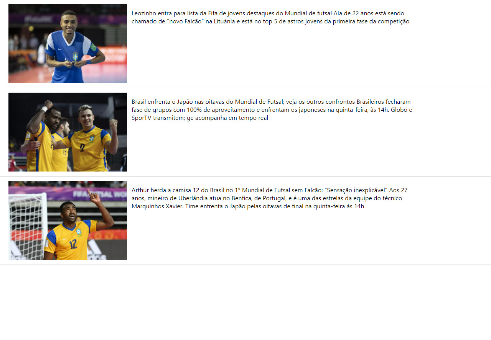

<h1 align="center">PHP + REACT JS
 </h1>

<h1 align="center">
    
</h1>

<p align="center">Mini portal de noticias com React Js + API PHP</p>

# Getting Started with Create React App

```sh
npx create-react-app [nome-do-projeto]
```

### Instalar NPM:

```sh
npm install
```

### Instalar dependencias:

```sh
npm install axios

```
### Iniciar Servidor:

```sh
yarn start

```
